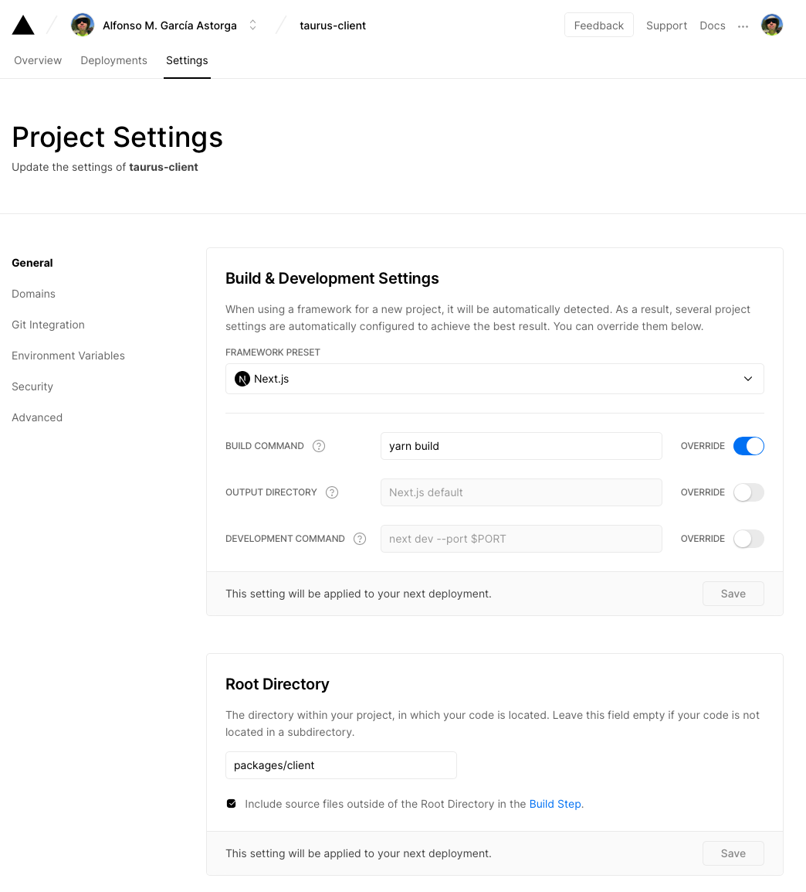

Vercel
======

[Vercel](https://vercel.com) is used to host the `client` application. Just connect your GitHub repository and use below project settings.

Vercel project settings
-----------------------

